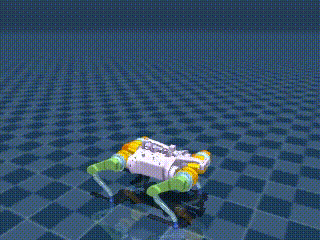

# Multi-Legged Robot Reinforcement Learning 


This repository focuses on the application of reinforcement learning (RL) algorithms to train a quadruped robot to navigate various terrains. The goal is to use RL techniques to improve the robot's locomotion by adjusting its movements based on the feedback from its environment. The repository includes three Jupyter Notebooks that explore training using Proximal Policy Optimization (PPO) and Soft Actor-Critic (SAC).

## Table of Contents
- [Key Features](#key-features)
- [Algorithms & Mathematical Formulation](#algorithms--mathematical-formulation)
- [Training Notebooks](#training-notebooks)
- [Reward Function](#reward-function)
- [Getting Started](#getting-started)
- [Results](#results)

---

## Key Features
- Three training configurations:
  - PPO with partial terrain (`train_ppo.ipynb`)
  - SAC baseline (`train_sac_v0.ipynb`)
  - PPO baseline (`train_ppo_v0.ipynb`)
- Pre-trained policies for immediate evaluation
- Custom reward function for stable locomotion
- Brax-MuJoCo integration for physics simulation

---

## Algorithms & Mathematical Formulation 

### 1. Proximal Policy Optimization (PPO)
Objective function with clipping:
$$L^{CLIP}(\theta) = \mathbb{E}_t[\min(r_t(\theta)\hat{A}_t, \text{clip}(r_t(\theta), 1-\epsilon, 1+\epsilon)\hat{A}_t)]$$
Where:
- $r_t(\theta) = \frac{\pi_\theta(a_t|s_t)}{\pi_{\theta_{old}}(a_t|s_t)}$
- $\hat{A}_t$ = advantage estimate
- $\epsilon$ = clipping range (0.2)

### 2. Soft Actor-Critic (SAC)
Maximize entropy-augmented reward:
$$
J(\pi) = \sum_{t=0}^T \mathbb{E}_{(s_t,a_t)}[r(s_t,a_t) + \alpha\mathcal{H}(\pi(\cdot|s_t))]
$$
Where:
- $ \mathcal{H} $ = entropy term
- $ \alpha $ = temperature parameter

Value function loss:
$$
L_V = \mathbb{E}_{s_t}[\frac{1}{2}(V_\psi(s_t) - \mathbb{E}_{a_t}[Q_\theta(s_t,a_t) - \log\pi_\phi(a_t|s_t)])^2]
$$

---

## Training Notebooks

### 1. `train_ppo.ipynb` (Partial Terrain)
- **Algorithm**: PPO with terrain randomization
- **Key Features**:
  - Partial terrain generation during training
  - Periodic environment resets
  - Output: `barkour_terrain_ppo_policy`

### 2. `train_sac_v0.ipynb` (Baseline)
- **Algorithm**: SAC with default parameters
- **Key Features**:
  - Continuous action space optimization
  - Automatic entropy tuning
  - Output: `barkour_v0_sac_policy`

### 3. `train_ppo_v0.ipynb` (Baseline)
- **Algorithm**: PPO with plain terrain
- **Key Features**:
  - Fixed ground plane
  - Conservative policy updates
  - Output: `barkour_v0_ppo_policy`

---

## Reward Function

Total reward $ R_t = \sum_{i=1}^6 w_i r_i $:

| Component | Mathematical Form | Weight $ w_i $ |
|-----------|--------------------|------------------|
| Forward Velocity | $ r_1 = v_x $ | 2 |
| Angular Velocity (Z-axis) | $ r_2$ = $\omega_z $ | 1 |
| Vertical Velocity Penalty | $ r_3 $ = -\|$v_z$\| | 1.5 |
| Angular Stability Penalty | $ r_4 = -\|\omega_{xy}\|^2 $ | -0.5 |
| Torque Maintenance | $ r_5 = -\|\tau\|^2 $ | 0.0002 |
| Orientation Penalty | $ r_6$ = -(\|$\phi$\| + \|$\theta$\|)  | 0.2 |

---

## Getting Started


All training and testing in this repository were conducted in Google Colab. To run the notebooks, follow these steps:

1. **Clone the repository:**

```bash
git clone https://github.com/iamkrunalrk/Learning-to-walk-quadruped-with-RL.git
```

2. **Open the notebooks in Google Colab:**

You can open any of the Jupyter notebooks directly in Google Colab by following these links:
- [train_ppo.ipynb](https://github.com/iamkrunalrk/Learning-to-walk-quadruped-with-RL.git)
- [train_ppo_v0.ipynb](https://github.com/iamkrunalrk/Learning-to-walk-quadruped-with-RL.git)
- [train_sac_v0.ipynb](https://github.com/iamkrunalrk/Learning-to-walk-quadruped-with-RL.git)

3. **Run the cells:**

Once the notebook is loaded in Colab, you can run each cell sequentially to train and test the robot.

---

## Simulation Environment

The robot training environment is powered by **Brax**, a physics engine developed by Google. **MuJoCo** (Multi-Joint dynamics with Contact) is used for simulating the robot's interaction with the environment, providing realistic physics-based feedback. These engines allow the robot to learn how to interact with obstacles and terrains in a dynamic environment.

---

## Evaluation and Results

The performance of the trained robot is evaluated based on its ability to navigate without falling, while maximizing speed and stability. The trained models have demonstrated significant improvements in the robot's motion, with the PPO and SAC models performing well in different environments.

---

## Results
